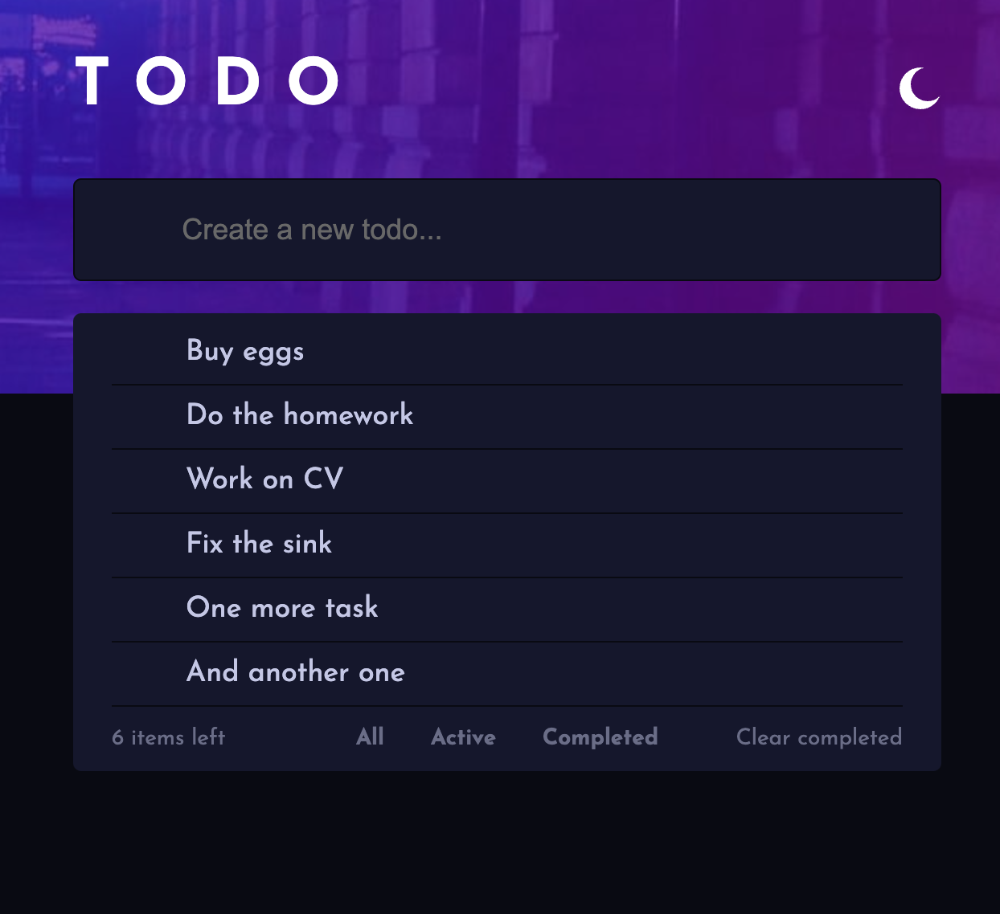
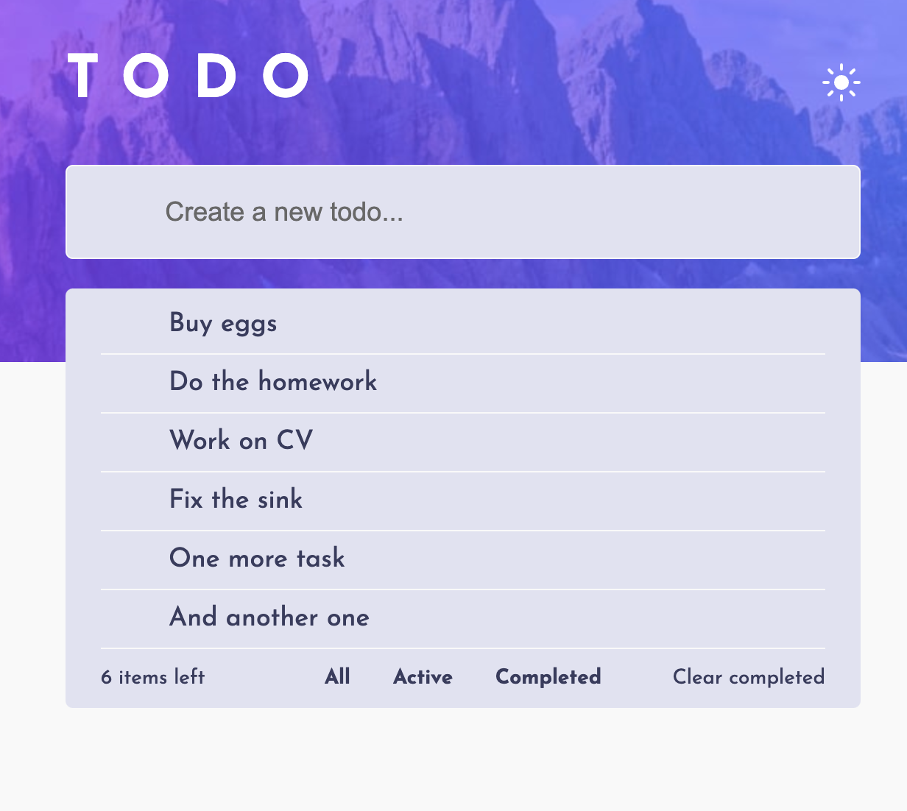
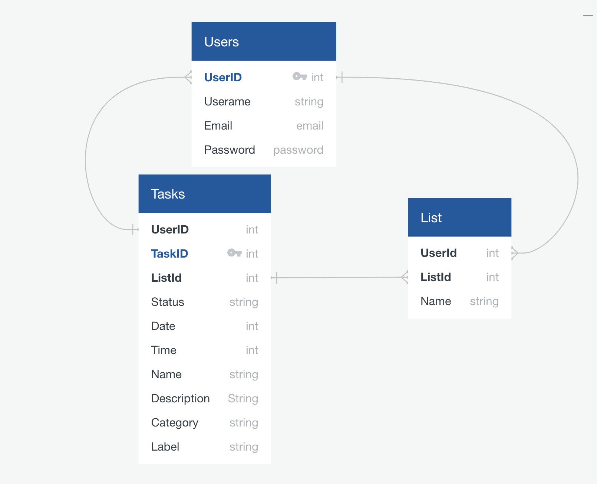

# GA SEI PROJECT 4 - A Flask + React App

This was a solo project created as a part of the General Assembly Software Engineering Immersive course.

The goal of the project was to create a full-stack application using Python, Flask, PostgreSQL and React. The application had to be a complete product with few relationships and CRUD functionality for at least a couple of models. I decided to make it simple on the back-end and focus on the front-end part of the project.

I decided to create a simple todo list application. The application allows the user to create, read, update and delete tasks. The user can also mark the task as completed. The user can also filter the tasks by all, active and completed tasks or clear out all the completed tasks.

## Getting started and deployment

- This project is split into two repositories. One for the backend:
  <https://github.com/Mehcanic/project-3-backend>  
  and one for the front-end: 
  <https://github.com/Mehcanic/project-4-frontend>

- The frontend is available to view [here](https://tosdos-apps.netlify.app)
- If you would like to take a look at the code please clone it and run:

- On the front-end:

```console
npm install

npm run dev
```

- On the back-end:

```console  
pipenv shell

pipenv install

pipenv install --dev

pipenv run flask run
```

## Timeframe

- It was a solo project and the timeframe for it was 2 weeks.

## Technologies used for this project

### Frontend

- React
- TypeScript
- React Router
- Axios
- Styled Components

### Backend

- Python
- Flask
- PostgreSQL
- SQLAlchemy
- Marshmallow
- Bcrypt
- JWT

### Deployment

- Insomnia
- bit.io
- fly.io
- Netlify

## Brief

- Build a full-stack application by making our own backend and front-end
- Use an Express API to serve our data from a Mongo database
- Consume our API with a separate front-end built with React
- Be a complete product which most likely means multiple relationships and CRUD functionality for at least a couple of models
- Implement thoughtful user stories/wireframes that are significant enough to help us know which features are core MVP and which we can cut
- Have a visually impressive design to kick our portfolio up a notch and have something to wow future clients & employers. ALLOW time for this.
- Be deployed online so it's publicly accessible.
- Have automated tests for at least one RESTful resource on the back-end. Improve our employability by demonstrating a good understanding of testing principles.


## Planning and Development procces

1. When I started planning this project, I decided to use Notion and Quick Database Diagrams. There is no wireframe for the project as I decided to use an existing design from frontendmentor.io as a basis for the application.

2. The first step was to determine the scope of the application. Given that I will be working on this project alone, I have decided to keep it simple. The application will enable users to create, read, update and delete tasks. Additionally, users can mark tasks as completed and filter them by all, active and completed tasks or clear out all completed tasks. For now, I have decided not to include login or sign up until the MVP is done as I wanted to focus on the front-end (React) part of the application. Python with Flask was something completely new for me and two weeks was not enough time to learn the back-end in new technology and make a nice front-end.

3. I used a design from frontendmentor.io as a basis for the application. The app has a working theme switcher, with the dark theme set as default as it is easier on the eyes:
    
    

    Using an existing design helped me focus on the structure of the application and ensure that all included features were working properly. However, one confusing aspect was that the design file did not provide proper descriptions of which colours should be used and where. I had access to a Figma file with the design (which I cannot include due to licensing issues) and had to figure out which colour should be used where.

4. I started building an application by creating models for the back-end. I decided to create three models for the application: User, Product and List of Tasks. I used Quick Database Diagrams to create the database diagram for the application:
    

    Here is an example of how the model for the user looks like:

    ```python
      class UserModel(db.Model, BaseModel):
      __tablename__ = "users"
      username = db.Column(db.String, unique=True, nullable=True)
      email = db.Column(db.Text, unique=True, nullable=True)
      password = db.Column(db.String, nullable=True)

      task = db.relationship("TaskModel", back_populates="user")
      lists_of_tasks = db.relationship("ListOfTasksModel", back_populates="user")

      def __repr__(self):
          return f"<User {self.username}>"
    ```

    Also, I have created the model for the base model to make the code a bit more DRY:

    ```python
      class BaseModel:
          id = db.Column(db.Integer, primary_key=True)
          created_at = db.Column(db.DateTime, default=datetime.utcnow, nullable=False)
          updated_at = db.Column(db.DateTime, default=datetime.utcnow, nullable=False)

          def save(self):
              db.session.add(self)
              db.session.commit()

          def delete(self):
              db.session.delete(self)
              db.session.commit()
    ```

5. After creating the models, I proceeded to create the schema for the application. To create the schema, I utilised Marshmallow, which is a Python library used to serialise and deserialize data. It was used to determine tables for the database. Here is an example of what the schema for the user looks like:

    ```python
      class UserSchema(ma.SQLAlchemyAutoSchema):
        tasks = fields.Nested("TaskSchema", many=True, exclude=("user",))
        list_of_tasks = fields.Nested("LabelSchema", many=True, exclude=("user",))

        class Meta:
            model = UserModel
            load_instance = True
            include_relationships = True
            include_fk = True
    ```

    ```python
      class BaseModel:
          id = db.Column(db.Integer, primary_key=True)
          created_at = db.Column(db.DateTime, default=datetime.utcnow, nullable=False)
          updated_at = db.Column(db.DateTime, default=datetime.utcnow, nullable=False)

          def save(self):
              db.session.add(self)
              db.session.commit()

          def delete(self):
              db.session.delete(self)
              db.session.commit()
    ```

6. The next step was to set up the app in the app.py file. I have created a blueprint for the application and imported all of the controllers. Here is the whole app.py file:

    ```python
      from flask import Flask
      from flask_sqlalchemy import SQLAlchemy
      from flask_marshmallow import Marshmallow

      from flask_cors import CORS

      from config.environment import db_URI

      app = Flask(__name__)
      app.config["SQLALCHEMY_DATABASE_URI"] = db_URI
      app.config["SQLALCHEMY_TRACK_MODIFICATIONS"] = False

      db = SQLAlchemy(app)

      ma = Marshmallow(app)

      CORS(app)

      from controllers import users_controllers
      from controllers import tasks_controllers
      from controllers import list_of_tasks_controllers

      app.register_blueprint(users_controllers.router, url_prefix="/api")
      app.register_blueprint(tasks_controllers.router, url_prefix="/api")
      app.register_blueprint(list_of_tasks_controllers.router, url_prefix="/api")
    ```

7. After setting up the app, I proceeded to create the controllers for the application. I have created three controllers for the application: users, tasks and a list of tasks. Below, I included 2 examples for the controllers. When the app was set up properly, I was able to test the controllers using Postman. Here is an example of what the controller for the user and task looks like:

    ```Python
    # controller for get all users
      @router.route("/users", methods=["GET"])
      def get_all_users():
          users = UserModel.query.all()
          return user_schema.jsonify(users, many=True), HTTPStatus.OK

    # controller for create a new task
      @router.route("/users/tasks", methods=["POST"])
      def create_task():
          task_dictionary = request.json
          try:
              task = task_schema.load(task_dictionary)
              task.save()
          except ValidationError as e:
              return {
                  "errors": e.messages,
                  "message": "Something went wrong when creating the task",
              }, HTTPStatus.UNPROCESSABLE_ENTITY
          return task_schema.jsonify(task), HTTPStatus.CREATED
    ```

8. That is all for the back-end. From now on, I started to focus on the front-end. I started by creating a React app with Vite and TypeScript. After I created the overall structure of the application, including components I was sure I will need in the future.

When the structure was set up, I focused on learning how to create a dark/light theme for the application. I did it in the main App.tsx file. To make it work, I created the theme.tsx file to contain all theme-related code. Here is an example of what the code looks like:

  ```javascript
    import { DefaultTheme } from 'styled-components'
    import '../main.css'

    const lightTheme: DefaultTheme = {
      id: 'light',
      background: {
        primary: 'hsl(220, 98%, 61%)',
        ...
      },
      colors: {
        primary: 'hsl(0, 0%, 98%)',
        ...
      },
      spacing: {
      },
      typography: {
        fontSize: {
          small: '14px',
          ...
        },
        fontFamily: "'Josefin Sans', sans-serif;'",
        fontWeight: {
          regular: 400,
          ...
      }
    }}
    export default { lightTheme, darkTheme };
  ```

Then the theme was imported to the App.tsx file:

  ```javascript
    import { ThemeProvider } from 'styled-components'
    import { lightTheme, darkTheme } from './styles/theme'

    function App() {
      const [theme, setTheme] = useState(darkTheme)
      const [icon, setIcon] = useState(iconMoon)

      const handleClick = () => {
        if (theme.id === 'dark') {
          setTheme({...theme, ...lightTheme})
          setIcon(iconSun)
        } else {
          setTheme({...theme, ...darkTheme})
          setIcon(iconMoon)
        }
      }

      return (
        <StyleSheetManager disableVendorPrefixes>
          <div className='application'>
            <ThemeProvider theme={theme}>
              <AppBackground />
              <AppContainer>
                <HeaderContainer>
                  <HeaderTitle />
                  <ThemeIcon icon={icon}  onClick={handleClick} />
                </HeaderContainer>
                <CreateTaskContainer className='createTask-container'>
                  <AddTask theme={theme} tasks={tasks} />
                </CreateTaskContainer>
                <ListContainer className='list-container'>
                  <ListOfTasks theme={theme} tasks={tasks} />
                </ListContainer>
              </AppContainer>
            </ThemeProvider>
          </div>
        </StyleSheetManager>
      )
    }
    export default App
  ```

The above code is using the ThemeProvider component from the styled-components library to provide a theme for the app. The theme is stored in the state using the useState hook. The initial theme is set to the dark theme.

The handleClick function is used to toggle between the light and dark themes. When the function is called, it checks the current theme and sets it to the opposite theme. It also sets the icon to either a sun or moon icon depending on the current theme.

The ThemeProvider component wraps the entire app and provides the theme to all of its children. The AppBackground, AppContainer, HeaderContainer, CreateTaskContainer, and ListContainer components all use the theme provided by the ThemeProvider.

After finishing the theme, I focused on creating the components for the application. These were styled using styled-components. From now on, it was relatively easy to create the components and style them.

## Challenges

The biggest challenge I faced was creating the app to refresh automatically when the user adds a task to the list of tasks instead of refreshing the page manually. Due to the project review date being too close, I decided to leave it for future improvement. I realised that I needed to restructure the app. What I mean by that is that the logic for rendering the tasks in the list of tasks should be kept together in one component. Currently, the logic for adding the task is split between the ListOfTasks and AddTask components. Unfortunately, I didn’t have enough time to restructure it, and therefore, the app is not refreshing properly.

Another significant challenge I encountered was that I started experiencing odd TypeScript issues that I didn’t have before. This was due to the fact that I started working on this README file weeks after finishing the project. Although I’m not sure what is causing it, I’m confident that rebuilding this project from scratch will have two significant benefits. First, it will fix the TypeScript issues, and second, the app will work as intended.

The last challenge was understanding how to set up an SQL database. It took me a while to figure out how to create relationships

## Wins

My biggest win during this project is that I feel much more comfortable with planning the application. From now on, I will spend more time planning and pseudocoding each major part of the application. If during the development process, I encounter any significant issues, I will stop developing and will focus on fixing the app in the planning stage. When it will be ready, I will continue with writing the code. This will help me to avoid any major issues during the development process.

Another win is that I feel much more comfortable with React and TypeScript and styling the app using styled-components. I feel like I have a good understanding of how to use these technologies to create a fully functional application. I'm aware that there is still a lot to learn but I feel like I'm on the right track.

## Future improvements

As I reflect on this project, there are several future improvements that I would like to implement. These improvements include:

- Fixing the Refreshing Issue: Currently, the app doesn’t refresh when the user adds a task to the list of tasks. I would like to fix this issue to improve the user experience.
- Completing the Bottom Part of the List: Currently, the filters for all, active, completed, and delete completed tasks are not working in the bottom part of the list.
- The ability to edit tasks would be a valuable addition to the app, allowing users to easily make changes to their existing tasks.
- Adding login and registration functionality would allow users to create an account, save their tasks, and access them from any device.


## Key Learnings

The key learnings from this project are:

- I learned that proper planning of the application is critical to the success of any project. From now I will be spending more time planning the project.
- With React and TypeScript, I was able to create a fully functional application that was both dynamic and scalable. This allowed me to create a user-friendly interface
- Styling the application was made easy with the use of styled-components. By learning how to leverage this tool, I was able to create a visually appealing application.
- The ability to store and manage data is a critical component of any application. By learning how to use an SQL database, I was able to efficiently store and manage data, ensuring the seamless operation of my application.
- Creating a Back-End with Flask: Creating a reliable back-end is essential to the overall functionality of the application. - - By learning how to use Flask, I was able to create a back-end that was both robust and efficient, allowing for a smooth and uninterrupted user experience.

